# Gobernanza de skills

Este catálogo no promueve una skill de canal ni de madurez porque "se ve completa" o porque se usó una vez de pasada.
Una lección se vuelve skill, y una skill sube de canal, solo cuando hay evidencia retenible que lo respalda.
El catálogo inicial (las 7 skills migradas desde `~/.claude/skills`) es anterior a este sistema y debe ganar su madurez retroactivamente — ver [`rounds/001-bootstrap-catalog`](rounds/001-bootstrap-catalog/README.md).

## Flujo de evidencia

```mermaid
flowchart TB
  Work["Trabajo real<br/>(sesión, entrega a cliente, auditoría)"]
  Evidence["Evidencia<br/>output real · comando corrido · entregable"]
  Candidate["Lección candidata"]
  Review{"Revisión humana"}

  Skill["Método de skill"]
  Case["Caso registrado"]
  Reject["Sin cambio"]
  Gap["Vacío, no entendido todavía"]

  Work --> Evidence
  Evidence --> Candidate
  Candidate --> Review

  Review -->|método reutilizable| Skill
  Review -->|precedente útil, no generalizable aún| Case
  Review -->|evidencia débil o anecdótica| Reject
  Review -->|no está claro todavía| Gap

  Skill --> Case
  Case -. respalda .-> Skill
```

Un caso (`foundry/cases/<archivo>.md`) es el registro mínimo: qué trabajo real fue, qué se hizo, qué salió. Una skill puede existir sin casos todavía (es lo normal en `experimental`), pero no puede subir de madurez sin al menos uno.

## Madurez de la skill

| Estado | Evidencia requerida |
|---|---|
| `experimental` | Existe un método coherente y un límite de disparo (`description`) claro |
| `dogfooded` | El método se usó en trabajo real y ese uso está registrado en `foundry/cases/` |
| `evaluated` | Existe una comparación contra la línea base (hacerlo sin la skill), aunque el resultado sea poco concluyente |
| `validated` | El efecto positivo se repitió en casos distintos, con revisión humana de por medio |
| `deprecated` | La evidencia o un método mejor muestra que ya no conviene recomendarla |

El registro de fuente de verdad es [`maturity.json`](maturity.json). **Ninguna skill es `validated` por defecto**, sin importar cuánto se use informalmente.

Las skills deprecadas no se borran: se conservan en `foundry/deprecated/<nombre>/` con su fuente completa y un link a la decisión que las deprecó.

## Canales de distribución

El canal responde "¿qué tan fuerte se recomienda instalarla?" — es independiente de la madurez.

| Canal | Significado | Superficie en el repo |
|---|---|---|
| `stable` | Superficie recomendada por defecto | `skills/<nombre>/` |
| `candidate` | Método instalable, listo para dogfooding enfocado | `skills/.experimental/<nombre>/` (mismo directorio que experimental; el canal vive solo en `maturity.json`) |
| `experimental` | Método temprano, contrato de disparo todavía sin probar | `skills/.experimental/<nombre>/` |

Importante: **madurez y canal no suben juntos automáticamente**. Que una skill llegue a `dogfooded` no la mueve sola a `stable` — mover de canal es una decisión explícita y separada (ver la [checklist de promoción](#checklist-de-promoción)). Solo cuando una skill llega a `stable` se mueve físicamente el directorio de `skills/.experimental/<nombre>/` a `skills/<nombre>/`.

## Dimensiones de estado independientes

No infieras una de otra. Regístralas por separado cuando corresponda:

| Dimensión | Valores de ejemplo | Responde |
|---|---|---|
| Validación técnica | sin validar, validado por vos mismo, validado independientemente | ¿Qué tan directo se probó, y quién lo probó? |
| Revisión humana | pendiente, completa | ¿Alguien revisó críticamente el caso y su evidencia? |
| Entrega | local, usada en un proyecto real, entregada a un cliente | ¿Qué tan lejos llegó realmente el resultado? |

Un caso "validado por vos mismo" es evidencia válida de que el método funciona para vos. No es lo mismo que una skill "revisada" por alguien más, ni que un entregable que efectivamente llegó a un cliente — no mezcles esas afirmaciones en una sola línea de `summary`.

## Checklist de promoción

Antes de subir la madurez o el canal de una skill:

- El caso de origen es real y su evidencia es recuperable (existe el archivo en `foundry/cases/`, no solo el recuerdo de que "funcionó bien").
- La skill está redactada sin asumir un proyecto, cliente o stack específico — si algo es específico de un cliente (ej. Palo Alto/SEK), esa especificidad está en la skill a propósito, no colada por accidente.
- La skill tiene un dueño único y no duplica a otra ya existente en el catálogo.
- La `description` sigue disparando en los casos correctos y no se dispara en pedidos parecidos pero distintos (revisión manual, no automatizada todavía).
- Una persona (vos) aprueba la promoción explícitamente — esto no lo decide el agente solo.

## Regla de gobernanza

Promové el cambio más chico que la evidencia sostenga. Eso puede ser: un caso registrado sin tocar la skill, una corrección puntual al `SKILL.md`, o —recién como último recurso— una skill nueva. Crear una skill nueva es el resultado más caro, no el default.

## Lo que este sistema deliberadamente no tiene todavía

El sistema de Railly (`Railly/skills`) además corre evals automatizados por skill (trigger, negative-trigger, method, outcome, transfer, regression) y usa telemetría de invocación real para detectar señales de uso. Acá no hay evals automatizados ni telemetría — la evidencia de uso se registra a mano en `foundry/cases/` cuando pasa. Es una limitación real, no un detalle menor: significa que "ningún caso registrado todavía" puede leerse como "no se usó" o como "se usó pero nadie lo anotó" — la Ronda que evalúe una promoción debe decir cuál de las dos es, no asumir. Si el catálogo crece y esto se vuelve un cuello de botella real, ahí se justifica construir esa infraestructura — no antes.
